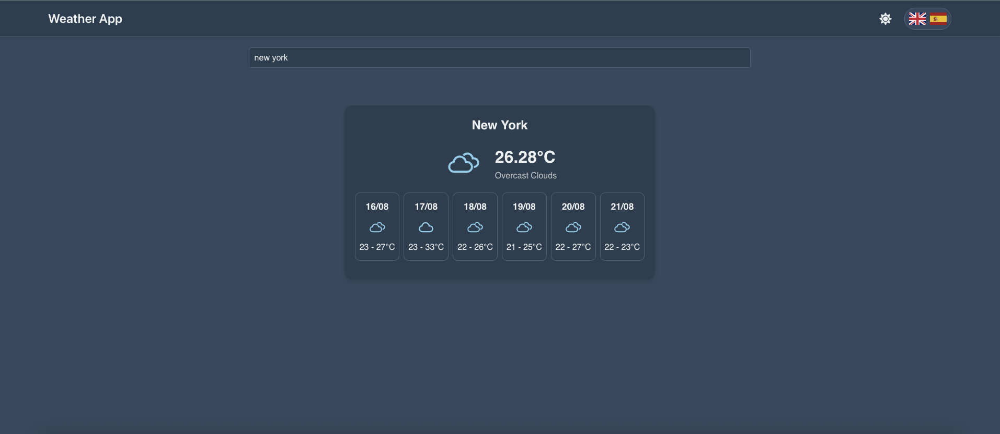

# React Weather App

A modern, feature-rich weather application built with React, Vite, and Redux Toolkit. It provides current weather conditions and a 5-day forecast based on the user's geolocation or a searched city. The application is designed to be performant, scalable, and easy to use, with a focus on a clean user interface and robust state management.



---

## ✨ Features

- **Current Weather:** Displays real-time weather data, including temperature, conditions (e.g., "clear sky"), and a dynamic weather icon.
- **5-Day Forecast:** Provides a daily forecast for the upcoming five days, showing minimum/maximum temperatures and weather conditions.
- **Geolocation Support:** Automatically fetches weather for the user's current location on initial load.
- **City Search:** A debounced search bar allows users to find weather information for any city worldwide.
- **Theme Toggling:** Switch between light and dark modes for comfortable viewing in any lighting condition.
- **Multi-language Support:** Fully internationalized using `i18next`, with support for English and Spanish.
- **State Persistence:** User preferences for theme and language are saved to `localStorage` for a consistent experience across sessions.
- **Error Handling:** Gracefully displays informative error messages for failed API requests or geolocation errors.

---

## 🛠️ Tech Stack

- **Frontend:** React
- **Build Tool:** Vite
- **State Management:** Redux Toolkit
- **Data Fetching:**
  - RTK Query for streamlined API requests and caching.
  - @tanstack/react-query for server state management.
- **Internationalization:** i18next with react-i18next
- **Styling:** CSS Modules
- **Icons:** React Icons

---

## 🚀 Getting Started

Follow these instructions to get a local copy of the project up and running.

### Prerequisites

- Node.js (v18 or higher)
- npm, yarn, or pnpm

### Installation

1.  **Clone the repository:**

    ```sh
    git clone https://github.com/Ibrakara/react-weather-app
    cd react-weather-app
    ```

2.  **Install dependencies:**

    ```sh
    npm install
    ```

3.  **Set up environment variables:**

    You will need an API key from OpenWeatherMap. Once you have your key, create a `.env` file in the root of the project and add your key:

    ```env
    VITE_OPENWEATHER_API_KEY=your_api_key_here
    ```

### Running the Application

1.  **Start the development server:**

    ```sh
    npm run dev
    ```

    The application will be available at `http://localhost:5173` (or another port if 5173 is in use).

2.  **Build for production:**
    ```sh
    npm run build
    ```
    This command creates a `dist` folder with the optimized production build.

---

## 📁 Project Structure

The project follows a standard React application structure, organized for clarity and scalability.

```
src/
├── components/     # Reusable, presentational components
├── containers/     # More complex components with logic
├── hooks/          # Custom React hooks
├── i18n/           # Internationalization configuration and translations
├── pages/          # Page components for different routes
├── services/       # API services, helpers, and localStorage logic
├── store/          # Redux Toolkit store, slices, and RTK Query APIs
│   ├── services/   # RTK Query API definitions
│   └── slices/     # Redux state slices
├── styles/         # Global styles and CSS modules
├── App.jsx         # Root application component with routing setup
└── main.jsx        # Application entry point
```

---

## 🤝 Contributing

Contributions are welcome! Please feel free to open an issue or submit a pull request.

---

## 📄 License

This project is licensed under the MIT License.
